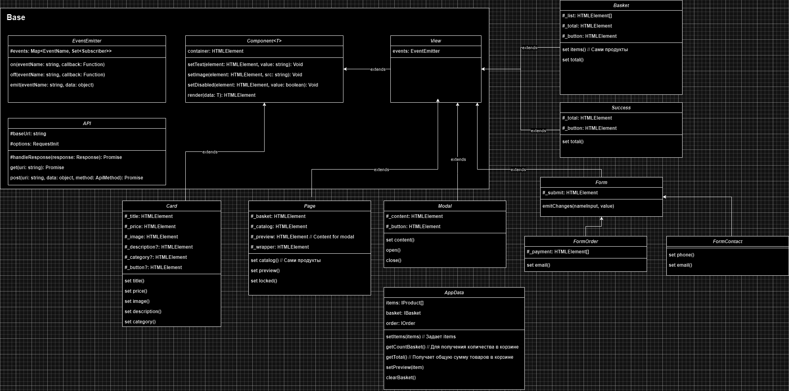

# Проектная работа "Веб-ларек"

Стек: HTML, SCSS, TS, Webpack

Структура проекта:
- src/ — исходные файлы проекта
- src/components/ — папка с JS компонентами
- src/components/base/ — папка с базовым кодом

Важные файлы:
- src/pages/index.html — HTML-файл главной страницы
- src/types/index.ts — файл с типами
- src/index.ts — точка входа приложения
- src/scss/styles.scss — корневой файл стилей
- src/utils/constants.ts — файл с константами
- src/utils/utils.ts — файл с утилитами

## Установка и запуск
Для установки и запуска проекта необходимо выполнить команды

```
npm install
npm run start
```

или

```
yarn
yarn start
```
## Сборка

```
npm run build
```

или

```
yarn build
```

## Документация проекта



### Об архитектуре
Взаимодействия внутри приложения происходят через события. 
- Компоненты отвечают за отоброжения данных
- Модели изменяют данные и инициируют события по определенным названиям. 
- В index.ts Мы работаем со всеми событиями и реагируем на них изменяя представления.

### Базовая часть

#### Клас EventEmitter
Брокер событий. На вход ничего не принимает, имеет 3 метода для работы с событиями  

**Методы**
- `on<T extends object>(eventName: string, callback: (event: T) => void)` Устанавливает событие. На вход принимает название события и callback
- `off(eventName: string, callback: Subscriber)` Убирает события. На вход принимает название события и callback
- `emit<T extends object>(eventName: string, data?: T)` Инициирует событие. На вход принимает название событие и данные которые поменялись

#### Класс API
Отвечает за формирование запросов.  
`constructor(baseUrl: string, options: RequestInit = {})` На вход принимает базовый url и опции запроса.  

**Методы**
- `protected handleResponse(response: Response): Promise<object>` Принимает ответ с сервера и обрабатывает
- `get(uri: string): Promise<Object>` На вход принимает endpoint и возвращает Promise с ответом (Нужен для получения данных)
- `post(uri: string, data: object, method: ApiPostMethods = 'POST'): Promise<Object>` На вход принимает endpoint и body запроса и метод запроса. Возвращает Promise с ответом. Нужен для добавление и изменение данных

#### Класс Component<T>
Абстрактный класс для создания интерфейсов приложения. Содержит базовые методы для работы с элементами DOM узла. Такие как установка текста, изображения, скрытие/показ элемента и рендер элемента
`constructor(protected container: HTMLElement)` На вход принимает ссылку на элемент за отоброжение которого отвечает  

**Методы**
- `toggleClass(element: HTMLElement, className: string)` Меняет селектор у элемента. Принимает element для которого нужно поменять и название селектора
- `setHidden(element: HTMLElement)` Прячет элемент, задает display: none. На вход принимает element который нужно скрыть
- `setText(element: HTMLElement, value: string)` Принимает element для которого нужно установить текст и сам текст
- `setImage(element: HTMLElement, src: string)` Устанавливает изображение элементу. Принимает element и src на само изображение
- `setDisable(element: HTMLElement, state: boolean)` Отключает действие на элемент. Принимает элемент и значение boolean. 
- `render(data: Partial<T>): HTMLElement` Принимает data которая соответсвует T. Копирует все свойство объекта в данный класс и возвращает HTMLElement

#### Класс View<T>
Класс наследует Component. Нужен для создания таких же элементов интерфейса, но берет на себя генерацию событий.  
`constructor(protected events: EventEmitter, container: HTMLElement)` На вход принимает container для передачи в Component и events EventEmitter брокер событий

### Классы представления

#### Класс Page
Класс наследует View. Реализует главную страницу приложение. Работает со счетчиком корзины, отоброжение модального окна, каталога товаров  
`constructor(events:EventEmitter, container: HTMLElement)` На вход принимает брокер событий и контейнер

**Свойства**
- `_basket` - HTMLElement Кнопка для открытия корзины
- `_catalog` - HTMLElement Для отоброжения каталога продуктов
- `_preview` - HTMLElement Отвечает за контент внутри модального окна
- `_wrapper` - HTMLElement Отвечает за саму главную страницу

**Методы/Сеттеры**
- `сеттер catalog` - Задает список продуктов
- `сеттер preview` - Задает какой контент откроется в модальном окне
- `сеттер locked` - Блокирует действия на главной странице

#### Класс Modal
Наследует  View. Реализует модальное окно. Работает с кнопкой закрытия и контентом.  

`constructor(events: EventEmitter, container: HTMLElement)` На вход принимает брокер событий и контейнер  

**Свойства**
- `_content` - HTMLElement Для отоброжения контента внутри модельного окна
- `_button` - HTMLElement Кнопка для закрытия модального окна

**Методы/Сеттеры**
- `сеттер content` - Задает контент модальному окну
- `open()` - Метод для открытия модального окна
- `close()` Метод для закрытия модального окна

#### Класс Basket
Наследует View работает с типом IBusket. Реализует представление корзины, отоброжает список выбранных товаров. Работает со списком товаров, окончательной ценой и кнопкой оформления  

`constructor(events: EventEmitter, container: HTMLElement)` На вход принимает брокер событий и контейнер  

**Свойства**
- `_list` - HTMLElement Для отоброжения списка карточек продукта
- `_total` - HTMLElement для отоброжения итоговой суммы товаров
- `_button` - HTMLElement для дальнейших действий после формирования корзины

**Методы/Сеттеры**
- `сеттер item` - Задает список товаров
- `сеттер total` - Задает итоговую сумму

#### Класс Success
Наследует View работает с типом IResult. Реализует представление завершения заказа, отоброжает успешную транзакцию и окончательную цену. Работает с окончательной ценой и кнопкой завершения.  

`constructor(events: EventEmitter, container: HTMLElement)` На вход принимает брокер событий и контейнер  

**Свойства**
- `_total` - HTMLElement для отоброжения конечного текста с итоговой суммой
- `_button` - HTMLElement для действия после завершении

**Методы/Сеттеры**
- `сеттер total` - Задает заголовок DOM узлу total

#### Класс Form<T>
Наследует View. Нужен для создания форм. Выбирает все формы и вешает на них обработчики, которые генерируют события на нужный инпут и так же работает с кнопкой submit  

`constructor(events: EventEmitter, container: HTMLElement)` На вход принимает брокер событий и контейнер  

**Свойства**
- `_submit` - HTMLElement кнопка для дальнейших действия после заполнения формы.

**Методы**
- `emitChanges(nameInput: string, value: string)` - Метод для обработки событий инпута и оповещения всех подписчиков об изменении. Принимает на вход имя инпута и значение инпута

#### Класс FormOrder
Наследует Form работает с типом IOrder. Реализует форму для оформления заказа, отоброжает выбор способа оплаты, инпут для адреса и кнопку продолжить. Работает с адресом, способом оплаты  

`constructor(events: EventEmitter, container: HTMLElement)` На вход принимает брокер событий и контейнер  

**Свойства**
- `_payment` - HTMLElement массив кнопок для выбора способы оплаты

**Методы**
- `сеттер email` - Задает значение email input

#### Класс FormContact
Наследует Form работает с типом IOrder. Реализует форму для контактной информации, отоброжает два инпута для данных пользователя и кнопку оплаты. Работает с почтой, с номером телефона  

`constructor(events: EventEmitter, container: HTMLElement)` На вход принимает брокер событий и контейнер  

**Методы/Сеттеры**
- `сеттер phone` - Задает значение для phone input
- `сеттер email` - Задает значение для email input

#### Класс Card
Класс наследует Component и работает с типом IProduct. Нужен для реализизации карточек в разных частях приложения.  

`constructor(container: HTMLElement)` На вход принимает контейнер  

**Свойства**
- `_title` - HTMLElement для отоброжения названия продукта
- `_price` - HTMLElement для отоброжения цены продукта
- `_image` - HTMLElement для отоброжения изображения продукта
- `_description` - HTMLElement для отоброжения описания продукта. (опционально) Может не отоброжаться
- `_category` - HTMLElement для отоброжения категории продукта. (опционально) Может не отоброжаться
- `_button` - HTMLElement для действия на карточке продукта. (опционально) Может не отоброжаться

**Методы/Сеттеры**
- `сеттер title` - Задает значение DOM узлу title
- `сеттер price` - Задает значение DOM узлу price
- `сеттер image` - Задает значение DOM узлу image
- `сеттер description` - Задает значение DOM узлу description
- `сеттер category` - Задает значение DOM узлу category

### Модель данных
#### AppData
Общая модель данных для работы приложения.

`constructor(events: EventEmitter)` На вход принимает брокер событий

**Свойства**
- `items: IProduct[]` Хранит в себе весь список продуктов
- `basket: IBasket` - Хранит корзину пользователя
- `order: IOrder` - Хранит в себе данные для заказа

**Методы**
- `setItems(items: IProduct[])` - Метод для инициализации items списка продуктов. На вход принимает items пришедшие с сервера
- `getCountBasket()` - Метод для подсчета количества товаров в корзине. Нужен для отоброжения счетчика
- `getTotal()` - Метод для подсчета конечной суммы товаров.
- `setPreview(item: IProduct)` - Метод для установки контента для модального окна
- `clearBasket()` - Очищает корзину пользователя

### Типы данных

#### IProduct
Нужен для работы с карточкой продукта.
- `id: string` - хранит уникальный id продукта
- `title: string` - Название продукта
- `description: string` - описание продукта
- `category: string` - Категория продукта, пример (софт-скилл, другое, дополнительно)
- `image: string` - ссылка на изображение продукта
- `price: number` - цена данного продукта

#### IBasket
Нужен для работы с корзиной пользвоателя
- `items: string[]` - Хранит id выбранных прродуктов
- `total: number` - Хранит общую стоимость продуктов

#### IOrder
Нужен для работы с заказом
- `address: string` - Хранит адрес пользователя
- `status: string` - Хранит спосос оплаты
- `email: string` - Хранит почту пользователя
- `phone: string` - Хранит номер телефона пользователя
- `items: string[]` - Список id выбранных товаров
- `total: number` - Сумму всех товаров

#### IOrderResult
Нужен для завершения заказа
- `id` - Хранит id заказа
- `total` - Итоговая сумма
