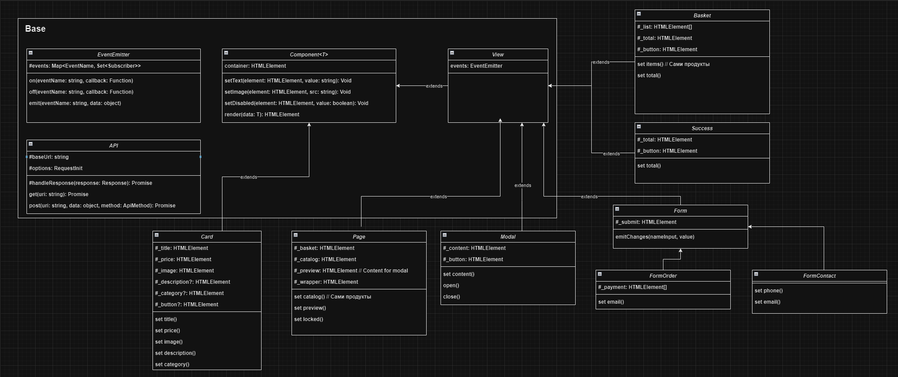

# Проектная работа "Веб-ларек"

Стек: HTML, SCSS, TS, Webpack

Структура проекта:
- src/ — исходные файлы проекта
- src/components/ — папка с JS компонентами
- src/components/base/ — папка с базовым кодом

Важные файлы:
- src/pages/index.html — HTML-файл главной страницы
- src/types/index.ts — файл с типами
- src/index.ts — точка входа приложения
- src/styles/styles.scss — корневой файл стилей
- src/utils/constants.ts — файл с константами
- src/utils/utils.ts — файл с утилитами

## Установка и запуск
Для установки и запуска проекта необходимо выполнить команды

```
npm install
npm run start
```

или

```
yarn
yarn start
```
## Сборка

```
npm run build
```

или

```
yarn build
```

## Документация проекта



### Базовая часть

#### Клас EventEmitter
Брокер событий. Используется для инициализации каких-либо событий и прослушивание их подписчиками.

#### Класс API
Отвечает за формирование запросов. Использует базовый url и базовые методы get и post для отправки запросов.

#### Класс Component
Абстрактный класс для создания переиспользуемых интерфейсов приложения. Содержит базовые методы для работы с элементами DOM узла. Такие как установка текста, изображения, скрытие/показ элемента и рендер элемента

#### Класс View
Класс наследует Component. Нужен для создания таких же элементов интерфейса, но берут на себя генерацию событий.

### Классы представления

#### Класс Page
Класс наследует View. Реализует главную страницу приложение. Работает со счетчиком корзины, отоброжение модального окна, каталога товаров

#### Класс Modal
Наследует  View. Реализует модальное окно. Работает с кнопкой закрытия и контентом.

#### Класс Basket
Наследует View. Реализует представление корзины, отоброжает список выбранных товаров. Работает со списком товаров, окончательной ценой и кнопкой оформления 

#### Класс Success
Наследует View. Реализует представление завершения заказа, отоброжает успешную транзакцию и окончательную цену. Работает с окончательной ценой и кнопкой завершения.

#### Класс Form
Наследует View. Нужен для создания форм. Выбирает все формы и вешает на них обработчики, которые генерируют события на нужный инпут и так же работает с кнопкой submit

#### Класс FormOrder
Наследует Form. Реализует форму для оформления заказа, отоброжает выбор способа оплаты, инпут для адреса и кнопку продолжить. Работает с адресом, способом оплаты

#### Класс FormContact
Наследует Form. Реализует форму для контактной информации, отоброжает два инпута для данных пользователя и кнопку оплаты. Работает с почтой, с номером телефона

#### Класс Card
Класс наследует Component реализует элемент карточки продукта. Работает с такими данными как заголовок продукта, категория, цена, описание, фотка.
